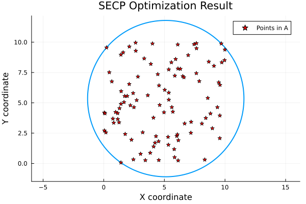
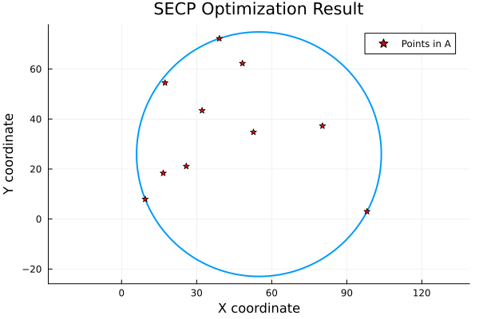

# SECP

[](https://github.com/lnhutnam/SECP.jl/actions/workflows/CI.yml?query=branch%3Amain)

A Julia implementation for solving the Smallest Enclosing Circle Problem (SECP), also known as the minimum covering circle problem, bounding circle problem, least bounding circle problem, or smallest enclosing circle problem.
$$
\min_{x \in \mathbb{R}^2} \max_{i=1,\ldots,n} \|x - p_i\|
$$
where:
- $x$ is the circle center
- $p_i$ are the input points
- $||·||$ is the Euclidean norm

The implementation uses a subgradient descent approach:
- Minimize the maximum distance from center to any point
- Update rule:  x_{k+1} = x_k - α * subgradient(x_k)



##  Installation

```sh
# Clone the repository
git clone https://github.com/yourusername/SECP.jl.git
cd SECP.jl

# In Julia REPL
using Pkg
Pkg.activate(".")
Pkg.instantiate()
```

## Quick start

```julia
using SECP
using Random

# Generate sample points
Random.seed!(42)
points = rand(10, 2) * 100  # 10 random points in [0,100]²

# Solve the SECP problem
center, radius = solve_secp(points)
# ([54.89433901282389, 25.942361692496842], 48.889022413804916)

# Visualize the result
plot_result = visualize_secp(points, center, radius)
display(plot_result)

println("Optimal center: $center") # Optimal center: [54.89433901282389, 25.942361692496842]
println("Minimum radius: $radius") # Minimum radius: 48.889022413804916
```



## 🤝 Contributing

Contributions are welcome! Please feel free to submit a Pull Request. For major changes, please open an issue first to discuss what you would like to change.

```sh
# Fork and clone the repository
git clone https://github.com/yourusername/SECP.jl.git

# Create feature branch
git checkout -b feature/amazing-feature

# Make changes and commit
git commit -m 'Add amazing feature'

# Push to branch
git push origin feature/amazing-feature
```


## 📄 License

This project is licensed under the MIT License - see the LICENSE file for details.